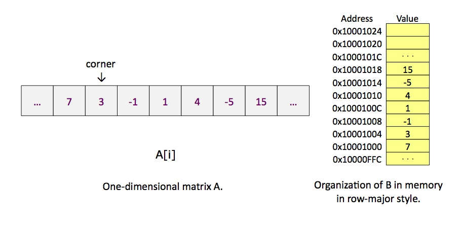
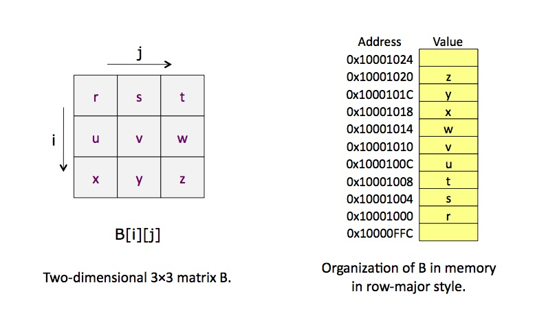
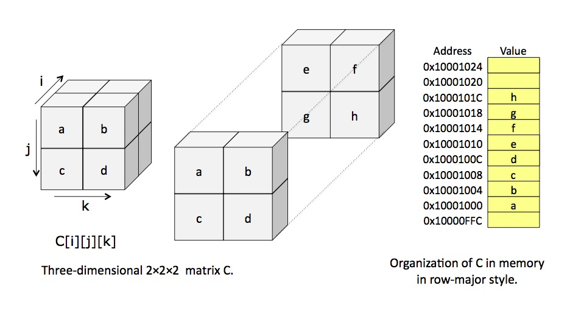

# CMPUT 229 Lab 3 - Cube Statistics

## Information
Subroutines are pervasive in large computer programs. They enable important features in large software systems: modularization, encapsulation, and reuse. Thus, it is important for a Computing Scientist to understand how subroutine linkage is implemented in assembly programs. Efficient implementation of subroutine linkage is also very important in the design and implementation of an optimizing compiler.

### Two Types of Linkage
There are two general methods for passing information to a subroutine. These are referred to as the *call-by-value* method and the *call-by-reference* method. In the call-by-value method the caller puts the actual data (number, characters, *etc*) needed by the subroutine either in a special register, such as register `$a0` in the MIPS architecture, or on the stack. When a subroutine linkage uses the call-by-reference method, the caller passes the **_addresses_** of the subroutine arguments to the callee. The call-by-value method is simpler, but the call-by-reference method is more powerful and more general.

The MIPS architecture defines a register calling-convention that reserves four 32-bit registers (registers `$a0` to `$a3`) to pass parameters to the subroutine. Each of these registers may contain the address of an object in memory, or it may contain a value of any type that can fit into 32-bits. When the parameters that need to be passed to the callee exceed the capacity of these four registers, they have to be written into the frame of the callee (on the stack) by the caller. Writing on the stack involves memory operations, which are expensive. Therefore, in general, it is more efficient to pass large objects by reference.

A given subroutine call may pass some parameters by value and some parameters by reference. Call-by-reference is useful if we want a variable allocated in the main routine to be modified directly by the subroutine. For example, we usually use a subroutine to read values from a file. These values need to be loaded into variables in the main routine. Thus, usually the file-input subroutine is called by reference.

### Obligations of the Caller and Callee
Linkage conventions depends on the underlying architecture. There may also be slight differences between different operating systems on the same architecture. In general, though, there are certain registers that a routine can use as *temporary* or *scratch* areas and others that, according to the linkage convention, must be preserved across a call.

In the MIPS architecture, registers `$t0 - $t9` are considered *temporary* registers. A subroutine can use any of these registers without saving them first. If a caller (main routine) is using any of these registers, it must save them somewhere before calling a subroutine, and then restore them once the subroutine returns. The caller must assume that the subroutine will use these registers. These registers are referred to as *caller-saved* registers.

In contrast, registers `$s0 - $s7` are considered *source* registers and must be preserved by a subroutine. If a subroutine uses any of these registers it must save them first, and restore the original values before it returns. These registers are referred to as *callee-saved* registers.

Only the registers that are actually used must be saved and restored. For example, if a caller is using registers `$t4` and `$t5`, then these are the only temporaries it must save before a call and restore afterwards. Similarly, if a subroutine uses `$s1`, `$s5`, and `$s7`, then these are the only registers it must save on entry and restore before returning; `$s2`, `$s3`, etc. do not need to be saved and restored if they are not used by the subroutine.

For efficiency, a caller should only save/restore `$t` registers that contain a variable whose value will be used after the call. In compiler parlance, a register that contains a value that will be used later in the program is called a *live variable*. Likewise, a subroutine should only save/restore `$s` registers that it modifies.

Therefore, we may need a place to save/restore registers in the caller/callee. One possibility would be to allocate dedicated space in the data segment. That would be fine if there is never any possibility that the routine will be in use multiple times concurrently. However, recursive or re-entrant code is fairly common, and cannot use this approach because it would overwrite the actual valid data on its second time in.

One nice solution is to use an *activation record* for every routine currently being executed, and store information about each invocation of a routine in its activation record. This will include values of registers that need to be saved and restored. To keep the management of activation records simple, we can store them in a stack. These activation records are called *frames* and thus they are refereed to as *stack frames*. Organizing information about the active routines this way has some nice side effects for debugging and monitoring systems. For example, to find out what is currently executing, we simply look at the frame that is on the top of the stack. To trace the sequence of calls that led to the current routine being activated, we simply trace through the frames on the stack.

When a routine needs to save the values of some registers, it simply pushes them onto the stack, in its stack frame. When the values need to be restored, they are just popped off the stack. The frame of a routine is also used to allocate space for variables that are local to the routine.

**Always remember:** the stack is just an area in main memory that we are using in a special way, by pushing things onto it and popping them off. You can think of it as supplementing the registers, but always remember that it is actually kept in main memory. Data in the stack must be loaded and stored in the same way as any other data in the machine.

The MIPS architecture has two special registers, `$fp` and `$sp`, that can be used to manage stack frames. `$fp`  is the frame pointer, and points to the beginning of the frame of the procedure that is currently executing. The value of `$fp` changes only on entry to and exit from a procedure - during the body of the procedure, its value is constant. `$sp` is the stack pointer, and it points to the last location in use on the stack. The value of `$sp` changes during the execution of a procedure, as values are pushed onto and popped off the stack.

The `$fp` register, known as the *frame pointer* is used when referencing values stored in the stack frame because the offset of a value saved in the frame is constant relative to `$fp`.

The `$sp` register, known as the *stack pointer* is used when adding values to or removing values from the stack because it tracks the current extent of the stack.

## Assignment
In this assignment, you will write a MIPS assembly program for the subroutine `CubeStats` that computes the floor of the average of certain elements of a multi-dimensional array. The elements of interest are specified by a `corner` and the size of the `edge` of a cube. The first parameter that `CubeStats` receives is the number of `dimensions` of the base array where the cube is contained. The second parameter is the `size` of the array. All the dimensions of the base array have the same size. Each element of the base array is a 32-bit integer. The specification for the `CubeStats` function is below:

* `CubeStats`:
  * **Arguments**
    * `$a0` = a non-negative integer that specifies the `dimensions` of the base array.
    * `$a1` = a non-negative integer that specified the `size` of the base array.
    * `$a2` = the address of the element of the base array that is the top left `corner` of the cube.
    * `$a3` = a non-negative integer that specifies the size of the `edge` of the cube.
  * **Return Values**
    * `$v0` = a signed integer containing the floor of the average of all negative elements in the specified cube.
    * `$v1` = a signed integer containing the floor of the average of the positive elements in the specified cube.

It is entirely possible that there will be either 0 positive or 0 negative elements. If this is the case, you must return the appropriate average as 0, while still calculating the other average. Your program should also take into account that 0 is neither positive nor negative. While MIPS division generates the integer floor for positive results, the same is not true of negative results.

To avoid making the assignment overly complex, your `CubeStats` routine may assume that the parameters are correct. There is no need to check if dimensions are positive, or if the size of the base array is equal to or larger than the edge of the cube, *etc*.

The following figure illustrates how `CubeStats` works on a single-dimensional array.

<p align="center">
  
</p>

Let's consider a call to `CubeStats` where the `corner` points to the position indicated in the figure, *i.e.* the value of `$a2` is `0x10001004`. The following table shows examples of calls to `CubeStats` to illustrate how it works. In the first call, there are no negative values, so the average of negative elements is `0` and the average of all the positive elements(`3`) is `3`. In example 2, the average of negative elements is the average of `-1`, which is of course `-1` and the average of positive elements is `(3+1)/2` which is `2`.

| Example | Function Call | Analyzed Cube | Return Values |
| --- | :---: | :---: | :---: |
| 1 | `CubeStats(1, 7, 0x10001004, 1)` | `[ 3 ]` | `$v0 = 0`, `$v1 = 3` |
| 2 | `CubeStats(1, 7, 0x10001004, 3)` | `[3, -1 , 1]` | `$v0 = -1`, `$v1 = 2` |
| 3 | `CubeStats(1, 7, 0x10001004, 5)` | `[3, -1, 1, 4, -5]` | `$v0 = -3`, `$v1 = 2` |

For arrays with dimension higher than one, you need to know the convention for storing the array in memory. The two most-used conventions are *row major* and *column major*. These names are derived from the layout of a two dimensional array. In a row-major storage, used in the C programming language, all the elements of a row appear in sequence in memory before any elements of subsequent rows. In a column-major storage, used in the Fortran programming language, all the elements of a column appear in sequence in memory before any elements of subsequent columns.

`CubeStats` expects multi-dimensional arrays to be stored in memory using a row-major layout. The following two figures illustrate the organization in memory for a 2-dimensional and a 3-dimensional array. Based on these examples, you should figure out how arrays of higher dimensions are stored in memory.

<p align="center">
  
</p>

<p align="center">
  
</p>

To obtain 100% of the marks in this lab, your `CubeStats` subroutine must be able to correctly handle *k*-dimensional arrays for any positive integer *k*.

You are given a [main program](resources/code/main-row-first.s) that does the following:

1. Reads a *k*-dimensional array from a file.
1. Places the values of the elements of the array in memory following the row-major layout.
1. Reads descriptions of cubes that appear in the file immediately after the array. For each cube, it:
 * initializes four global variables: `totalNeg`, `totalPos`, `countNeg` and `countPos` (see below);
 * calls your `CubeStats` subroutine for that cube;
 * prints the values returned by `CubeStats`.

 **Reading and understanding this main program is part of the assignment.**

 We use the 3-dimensional array `C[i][j][k]` in the figure above to describe the format of the file read by the main program. We would like you to think of the file format in the following form (however this is not the actual format that you will use, see below):

 ```
 3 2
 a b
 c d
 e f
 g h
 1 0 1 1
 0 0 0 2
 -1
 ```

The first line in the file contains the dimension and the size of the array. Each subsequent line, up to the line containing the elements `g` and `h`, contains the values in one row of the array. The letters `a` through `h` are used here to represent arbitrary integer numbers, in an actual example you would have integer numbers in place of these letters. The next line containing `1 0 1 1` specifies a cube with corner [1][0][1] and with edge 1. Thus, this is the cube containing the single element `f`. The following line containing `0 0 0 2` specifies a cube with corner [0][0][0] and with edge equal 2. Thus, this cube contains all the elements shown in the figure. The last line in the file contains the number `-1` to indicate that there are no more cubes to be analyzed.

Unfortunately, the SPIM `read-int` syscall does not recognize a white space as a separator between numbers. Therefore, all the white spaces in the format above must be replaced by newlines. Thus, the file is more difficult to be read by humans. The program will not read any character after it encounters the line containing `-1` that signals the end of the file. Thus, a good strategy is to maintain the data in the format above at the end of the file so that we can more easily examine the file when debugging the program.

To help you get started with the debugging of your program, we also provide two example files ([example1](resources/txt/example1) and [example2](resources/txt/example2)) that you can use. You are encouraged to create your own test cases.

To run a test case, you need to join your solution with the main program. You can do that using the `cat` command in linux. If you named your solution `JaneDoeCubeSolution.s` and you want to run it with the tests in the file `example1` you would do the following:

```
cat main-row-first.s JaneDoeCubeSolution.s > t.s  
spim -f t.s < example1
```

You must adhere to the MIPS calling convention: any routine that uses any of the `$s` registers must save them at the beginning of the routine and restore them before returning. **You are required to do this using stack frames**.

### Hints on Implementing and Debugging This Assignment
The logic that you need to implement to access a cube inside the base array is fairly complex. Therefore we strongly advise you to write your code in a higher-level notation or programming language, and convince yourself that it is working correctly before you code it in MIPS assembly. To help you out with the coding of this routine in a higher-level language, you are provided with the file [main-row-first.c](resources/code/main-row-first.c) which contains a main function that does the same thing as the assembly main program that is also provided to you.

The C version of the main program initializes three global variables before calling the subroutine `CubeStats`: `totalPos`, `totalNeg`, `countPos` and `countNeg`. In the assembly version of the main program four memory locations are used to contain these variables. One word (4 bytes) is used for each of the four global variables: `totalPos`, `totalNeg`, `countPos` and `countNeg`. The initialization of these global variables in `main` is done to facilitate the implementation of the `CubeStats` subroutine. However, you are not required to use these global variables in your implementation, because they are not part of the specification of `CubeStats`.

### Test Generator
Here is a [test generator](resources/code/CubeStatsTestGenerator.py), written in Python, that you can use to generate different tests for your program. That directory contains a Python program that generates the tests and several test cases with the corresponding output. Feel free to change the test generator. The test generator allows you to generate any size of arrays. However, the *arena* in your program is only 32 KB in size, which imposes a limit of 8,192 words for storing the array. If you generate large arrays and get weird behaviour, this is most likely because you are accessing memory outside of the arena. You can increase the size of the arena, but at some point you will run into the maximum amount of space that SPIM allows you to allocate in the data area (around 60 KB or so). All tests used for grading will fit within the arena specified in the main program distributed with the lab assignment.

## Resources
* Slides used for in-class introduction of the lab ([.pdf](resources/slides/class.pdf))
* Slides used for in-lab introduction of the lab ([.pdf](resources/slides/lab.pdf))

## Marking Guide
Here is the [mark sheet](MarkSheet.txt) used for grading. Assignments that are too short to be adequately judged for code quality will be given a zero. In particular, your submission will be evaluated as follows:
* 10% for code cleanliness, readability, and comments
* 10% for proper use of stack loads or stores (if needed)
* 60% for calculating correct statistics for dimensions up to 3
* 20% for calculating correct statistics for dimensions 4 and up

## Submission
There is a single file to be submitted for this lab. The file name should be `lab3.s`, and it should contain only the code for the functions specified above. Make sure to not include a `main` function in your solution.

**Please make sure that you follow the link provided in the course eClass page for this lab assignment to get your own private GitHub repo for this lab. To ensure that we have the latest version of your solution, make sure to commit your changes to the repo frequently. Otherwise, you may forget to commit your latest changes by the deadline (which will count as a late lab, and will not be graded). Your solution will be automatically collected via GitHub Classroom by the deadline. Your solution MUST include the [CMPUT 229 Student Submission License](LICENSE.md) at the top of the file containing your solution and you must include your name in the appropriate place in the license text.**
